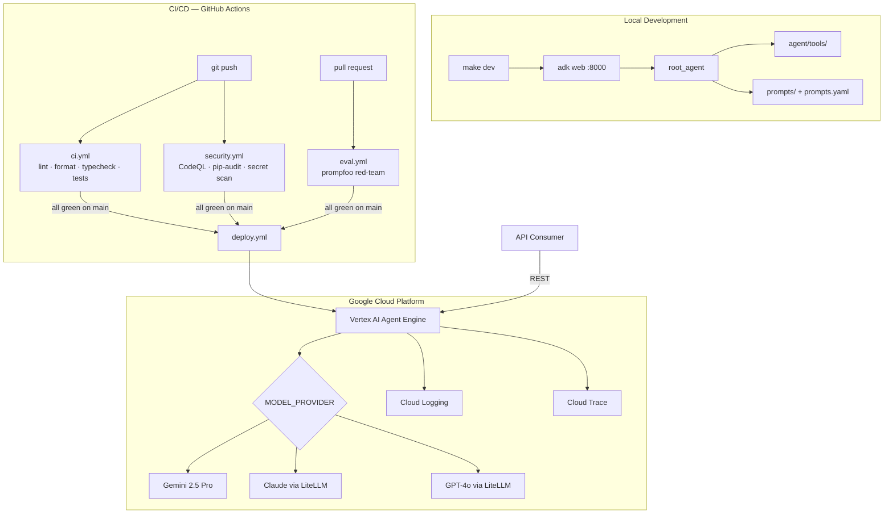
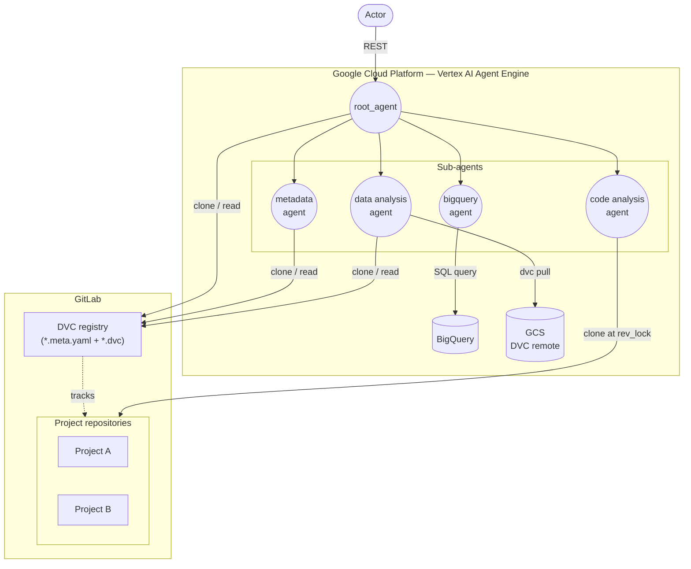

# Data Trace Agent

An agent that links Git and DVC metadata with direct access to BigQuery and GCS to answer questions about the evolution and content of datasets.

Built with [Google ADK](https://google.github.io/adk-docs/) and deployed on [Vertex AI Agent Engine](https://cloud.google.com/vertex-ai/docs/agents/overview).

## Architecture



## Agent Architecture



## Quickstart

### Prerequisites

- Python 3.11+, [uv](https://docs.astral.sh/uv/), Node.js 22+ (promptfoo requires >=22.22.0)
- [gcloud CLI](https://cloud.google.com/sdk/docs/install) authenticated

### Local development

```bash
make install              # install dependencies
cp .env.example .env      # configure environment variables
make dev                  # run at http://localhost:8000
```

### Run tests

```bash
make test                 # unit tests with coverage
make eval                 # promptfoo red-team evaluation
```

### Deploy to GCP

```bash
make setup-gcp            # one-time GCP bootstrap (creates SA, bucket, key)
make deploy-dev           # deploy to dev Agent Engine resource
make deploy-prod          # deploy to prod
```

## Make targets

| Target | Description |
|---|---|
| `make dev` | Run agent locally at http://localhost:8000 |
| `make test` | Unit tests with coverage |
| `make eval` | Prompt security evaluation (promptfoo) |
| `make lint` | Ruff lint check |
| `make format` | Ruff formatter |
| `make typecheck` | Pyright |
| `make deploy-dev` | Deploy to Agent Engine (dev) |
| `make deploy-prod` | Deploy to Agent Engine (prod) |
| `make health-check` | Smoke-test the deployed resource without redeploying |
| `make rollback` | Redeploy a previous git ref: `make rollback REF=<tag> [ENV=prod\|dev]` |
| `make logs` | Stream Cloud Logging |
| `make traces` | List this agent's Cloud Trace spans |
| `make setup-gcp` | One-time GCP bootstrap |
| `make setup-monitoring` | One-time Cloud Monitoring dashboard + alert policy bootstrap |
| `make pre-commit` | Run all pre-commit hooks |

## Environment variables

| Variable | Required | Description |
|---|---|---|
| `GOOGLE_CLOUD_PROJECT` | Deploy | GCP project ID |
| `GOOGLE_CLOUD_LOCATION` | Deploy | Vertex AI region (default: `europe-west1`) |
| `GCS_STAGING_BUCKET` | Deploy | GCS bucket for Agent Engine artefacts |
| `REPO_URL` | No | Remote Git URL of the DVC registry; cloned on first use |
| `GIT_AUTH_TOKEN` | No | Git token (deploy token / PAT) for cloning private repos in headless runtimes |
| `GIT_AUTH_HOST` | No | Host the token is valid for (defaults to the host of `REPO_URL`) |
| `GIT_AUTH_USERNAME` | No | Username for token-HTTPS clones (default: `oauth2`) |
| `GIT_AUTH_TOKEN_SECRET` | No | Secret Manager secret id for the Git token (preferred at deploy) |
| `AGENT_ENGINE_SERVICE_ACCOUNT` | No | Service account the deployed agent runs as; grant it read on DVC remote buckets |
| `DVC_CONFIG_LOCAL` | No | Verbatim DVC workspace config for config-based remotes (WebDAV, SSH) |
| `DVC_CONFIG_LOCAL_SECRET` | No | Secret Manager secret id for `DVC_CONFIG_LOCAL` |
| `AGENT_ENGINE_RESOURCE_NAME` | No | Existing resource to update (omit = create new) |
| `MODEL_PROVIDER` | No | `google` \| `anthropic` \| `openai` \| `litellm` |
| `GOOGLE_API_KEY` | Local dev | Not needed on GCP (uses ADC) |
| `ANTHROPIC_API_KEY` | If provider=anthropic | |
| `OPENAI_API_KEY` | If provider=openai | |
| `CLOUD_TRACE_ENABLED` | No | Export tool spans to Cloud Trace; set automatically on the deployed resource |

## Model providers

Set `MODEL_PROVIDER` in `.env`:

| Value | Model |
|---|---|
| `google` (default) | Gemini 2.5 Pro |
| `anthropic` | Claude Opus 4.8 via LiteLLM |
| `openai` | GPT-4o via LiteLLM |
| `litellm` | Any model — set `LITELLM_MODEL` |

## Logging and traces

```bash
make logs                                              # stream Cloud Logging
uv run python deployment/scripts/read_traces.py        # list trace roots
uv run python deployment/scripts/read_traces.py --spans # expand tool spans
```

Both require `GOOGLE_CLOUD_PROJECT` in `.env`.

All 26 tools are wrapped with `@instrument` (`agent/observability.py`), which logs a
start/end/error event per call and opens a span. Logs reach Cloud Logging with no
configuration; traces do not — `deployment/config.py` sets `CLOUD_TRACE_ENABLED` and
`OTEL_EXPORTER_GCP_TRACE_PROJECT_ID` on the deployed resource, and without both, nothing is
exported. Tool spans are children of ADK's `invoke_workflow` root, so use `--spans` to see
them. See [AGENTS.md](AGENTS.md#observability) for the full event and field reference.

## Security

Prompt injection, jailbreak, and PII tests run automatically on every PR via [promptfoo](https://promptfoo.dev). Add test cases in `tests/evals/promptfoo.yaml`. See [SECURITY.md](SECURITY.md) for the vulnerability disclosure policy.

## Contributing

See [CONTRIBUTING.md](CONTRIBUTING.md). AI assistants: read [AGENTS.md](AGENTS.md) for full project context and working instructions.
